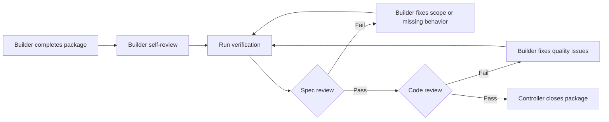

# csvtolabels.com Lean AIDLC Implementation Plan

> **For agentic workers:** REQUIRED SUB-SKILL: Use superpowers:subagent-driven-development for implementation packages, with spec compliance review first and code quality review second. Do not run multiple implementation agents against the app at the same time.

**Goal:** Use a lean AI-assisted development lifecycle to ship, validate, and iterate csvtolabels.com without overbuilding.

**Architecture:** Codex acts as the controller. Implementation happens in four sequential work packages, each followed by two review gates. Browser QA, deployment, launch assets, and metrics review happen as controller-invoked modes, not as permanent standing agents.

**Tech Stack:** Codex, isolated git branch or worktree, Vite, React, TypeScript, Vitest, Testing Library, `bwip-js`, `papaparse`, `jspdf`, Stripe Payment Links, Vercel or Netlify, Plausible or PostHog.

---

## Source Documents

- Product plan: `docs/superpowers/plans/2026-06-16-csvtolabels-elegant-500mrr-v2.md`
- Visual review: `docs/superpowers/plans/2026-06-16-csvtolabels-elegant-500mrr-v2-visual.html`

## Core Judgment

The elegant AIDLC for this project is not a large agent organization. It is a thin operating loop:

```text
Plan locked
-> product challenge gate
-> isolated branch/worktree
-> build package 1
-> spec review + code review
-> build package 2
-> spec review + code review
-> build package 3
-> spec review + code review
-> build package 4
-> spec review + code review
-> browser QA
-> deploy
-> launch sprint
-> daily scorecard
-> continue / adjust / pivot
```

The purpose is to keep velocity high while preventing the common failure mode: agents expanding a simple paid utility into a broad barcode platform.

This is not a yes-man loop. The controller must challenge the product assumptions before implementation starts. If the challenge gate finds a weak assumption that would materially change what should be built, implementation stops and the plan is revised.

## Product Challenge Gate

Run this before creating the implementation branch or dispatching a builder.

Purpose: decide whether the current MVP is still the best test to run, not merely whether it can be built.

Required questions:

1. **Buyer:** Who has enough urgency to pay: Shopify sellers, Etsy sellers, small warehouse operators, Amazon sellers, retail shop owners, or a different beachhead?
2. **Pain:** Is the painful job "generate barcodes" or "print many labels from a spreadsheet without fighting software"?
3. **Frequency:** Is this recurring enough for $29/month, or should the first paid offer be one-time by default?
4. **Channel:** Can the first 500-1,000 targeted visitors realistically be reached through problem threads, outreach, and exact-match ads?
5. **Paid moment:** Does clean PDF export create enough value after free preview, or is the gate too late or too early?
6. **Scope:** Is Code 128 plus Avery 5160 enough for the first beachhead, or does the beachhead require a different first template?
7. **Operations:** Can support stay near zero with disclaimers, sample CSV, and no account system?

Required output:

```text
PRODUCT_STATUS: PROCEED | REVISE | STOP
STRONGEST_ASSUMPTION:
WEAKEST_ASSUMPTION:
BUILD_SCOPE_CHANGE:
GO_TO_MARKET_CHANGE:
USER_DECISION_REQUIRED:
```

Proceed only if:

- The beachhead user is explicit.
- The urgent job is spreadsheet-to-printable-labels, not generic barcode generation.
- The first paid offer is justified.
- The acquisition path can plausibly create targeted traffic within 21 days.
- No required scope change contradicts the "no broad barcode SaaS" constraint.

Revise before building if:

- The beachhead is too vague.
- The product would need another label template to satisfy the first buyer.
- One-time purchase is clearly more natural than subscription and pricing needs to be reordered.
- The acquisition path depends mainly on SEO ranking within three weeks.

Stop before building if:

- The only clear traffic source is broad free-generator traffic.
- The buyer needs official UPC/GS1 issuance.
- The MVP requires accounts, Shopify OAuth, inventory management, or support-heavy setup to be valuable.

## Non-Negotiable Scope

Build only:

- CSV paste and CSV upload.
- Code 128 barcode validation and rendering.
- Avery 5160 label preview.
- Watermarked preview PDF.
- Paid clean PDF export via Stripe Payment Links.
- SEO/disclaimer pages.
- Launch assets and daily scorecard.

Do not build:

- Backend or database.
- User accounts.
- Shopify OAuth.
- Stripe webhooks.
- UPC-A, EAN, QR codes, or official GS1 issuance.
- Multiple label templates.
- Saved templates.
- Inventory management.
- Drag-and-drop label design.
- Team plans.

Any request outside this scope is logged as validation evidence, not built, unless the user explicitly approves a plan update.

## Operating Roles

These are modes the controller invokes. They are not separate permanent teams.

### 1. Controller Mode

Owner: Codex main thread.

Responsibilities:

- Run the Product Challenge Gate before implementation.
- Keep the source product plan as the authority.
- Maintain the task queue.
- Dispatch one build package at a time.
- Decide what context each worker receives.
- Stop implementation when scope expands.
- Summarize progress, risks, verification, and next action.

### 2. Builder Mode

Owner: one implementation worker at a time.

Responsibilities:

- Implement the assigned package only.
- Use tests first for deterministic logic.
- Run package-specific verification.
- Self-review the diff.
- Report status as `DONE`, `DONE_WITH_CONCERNS`, `NEEDS_CONTEXT`, or `BLOCKED`.

Required output:

```text
STATUS:
FILES_CHANGED:
TESTS_RUN:
RESULT:
CONCERNS:
```

### 3. Spec Review Mode

Purpose: protect the plan.

Checks:

- Did the package implement every required behavior?
- Did it skip an acceptance criterion?
- Did it add extra scope?
- Did it preserve the no-backend, no-auth, no-Shopify, no-extra-template constraint?

Required output:

```text
SPEC_STATUS: PASS | FAIL
MISSING_REQUIREMENTS:
EXTRA_SCOPE:
REQUIRED_FIXES:
```

### 4. Code Review Mode

Purpose: protect maintainability.

Checks:

- Type safety.
- Test quality.
- File boundaries.
- Error handling.
- PDF layout correctness.
- Payment-link safety.
- UI regressions.
- Build reliability.

Required output:

```text
QUALITY_STATUS: PASS | FAIL
CRITICAL_ISSUES:
IMPORTANT_ISSUES:
MINOR_ISSUES:
REQUIRED_FIXES:
```

### 5. Browser QA Mode

Purpose: test the MVP like a cold buyer.

Run after the four packages are integrated.

Checks:

- Paste CSV with `sku,name,price`.
- Paste CSV with unknown headers and confirm first-column fallback.
- Upload CSV file.
- Confirm empty CSV error state.
- Confirm invalid Code 128 characters show an error.
- Preview labels.
- Export watermarked preview PDF.
- Test `?unlock=export-pass`.
- Test `?unlock=pro`.
- Check mobile layout.
- Check SEO/disclaimer routes.

### 6. Launch Mode

Purpose: prepare acquisition without pretending SEO will deliver in three weeks.

Outputs:

- Stripe setup checklist.
- Outreach templates.
- Community reply drafts.
- Exact-match ad test.
- Daily scorecard.
- Launch checklist.

Human gate: the user approves outbound copy before anything is sent or posted.

### 7. Metrics Mode

Purpose: make continue, adjust, or pivot decisions from behavior.

Track daily:

- Visitors.
- CSV paste/upload users.
- Label preview users.
- Export clicks.
- Checkout clicks.
- Export Pass purchases.
- Pro subscriptions.
- MRR.
- One-time revenue.
- Top source.
- Top objection.
- Tomorrow's action.

## Four Work Packages

The source plan has eight implementation tasks. For execution, group them into four reviewable packages to reduce coordination overhead.

### Package 1: Foundation And Core Data

Source tasks covered:

- Task 1: Scaffold the app.
- Task 2: CSV parsing.
- Task 3: Code 128 validation.

Files expected:

- `package.json`
- `package-lock.json`
- `index.html`
- `vite.config.ts`
- `tsconfig.json`
- `src/main.tsx`
- `src/App.tsx`
- `src/styles.css`
- `src/test/setup.ts`
- `src/lib/csv.ts`
- `src/lib/csv.test.ts`
- `src/lib/barcode.ts`
- `src/lib/barcode.test.ts`

Acceptance criteria:

- App scaffold builds.
- CSV parser handles named code columns.
- CSV parser falls back to first filled column.
- Blank CSV returns a user-facing error.
- Code 128 validation accepts printable SKU values.
- Code 128 validation rejects blank and non-printable values.

Verification:

```bash
npm install
npm test -- src/lib/csv.test.ts src/lib/barcode.test.ts
npm run build
```

Gate:

- Spec review must pass.
- Code review must pass.

### Package 2: Export And Monetization Path

Source tasks covered:

- Task 4: Unlock and pricing gate.
- Task 5: Avery 5160 PDF export logic.

Files expected:

- `.env.example`
- `src/lib/unlock.ts`
- `src/lib/unlock.test.ts`
- `src/lib/pdf.ts`
- `src/lib/pdf.test.ts`

Acceptance criteria:

- `?unlock=export-pass` unlocks clean export.
- `?unlock=pro` unlocks clean export.
- Unknown query params do not unlock export.
- Missing Stripe links fall back to local pricing anchors.
- Avery 5160 label positions match the source plan.
- Free preview export is limited to 10 rows.
- Unlocked export allows the validation-limit row count.

Verification:

```bash
npm test -- src/lib/unlock.test.ts src/lib/pdf.test.ts
npm run build
```

Gate:

- Spec review must pass.
- Code review must pass.
- Any PDF layout concern must be resolved before Package 3.

### Package 3: Single Workflow UI And SEO

Source tasks covered:

- Task 6: Build the single workflow UI.
- Task 7: SEO and disclaimer pages.

Files expected:

- `src/App.tsx`
- `src/styles.css`
- `src/components/Hero.tsx`
- `src/components/CsvInput.tsx`
- `src/components/PreviewTable.tsx`
- `src/components/LabelPreview.tsx`
- `src/components/ExportGate.tsx`
- `src/content/pages.ts`
- `public/robots.txt`
- `public/sitemap.xml`

Acceptance criteria:

- User can paste CSV.
- User can upload CSV.
- User can see parsed rows.
- User can preview labels before payment.
- User can see Export Pass and Pro offers.
- User can reach Stripe links or fallback pricing anchors.
- SEO pages render route-specific copy.
- GS1/UPC disclaimer exists.
- UI does not require signup before preview.

Verification:

```bash
npm test
npm run build
test -f dist/robots.txt
test -f dist/sitemap.xml
```

Gate:

- Spec review must pass.
- Code review must pass.
- Browser QA mode starts immediately after this package.

### Package 4: Launch Assets And Deployment Readiness

Source tasks covered:

- Task 8: Launch assets.
- Deployment readiness from the 21-day execution calendar.

Files expected:

- `docs/launch/stripe-setup.md`
- `docs/launch/outreach-templates.md`
- `docs/launch/community-replies.md`
- `docs/launch/ad-test.md`
- `docs/launch/daily-scorecard.md`
- `docs/launch/launch-checklist.md`

Acceptance criteria:

- Stripe setup explains the $19 Export Pass.
- Stripe setup explains the $29/month Pro plan.
- Success URLs include `?unlock=export-pass` and `?unlock=pro`.
- Outreach copy is accurate and non-spammy.
- Community replies disclose the tool clearly.
- Exact-match ad test has a $300 cap and stop rules.
- Daily scorecard contains all required metrics.
- Launch checklist separates user-owned and agent-owned actions.

Verification:

```bash
test -f docs/launch/stripe-setup.md
test -f docs/launch/outreach-templates.md
test -f docs/launch/community-replies.md
test -f docs/launch/ad-test.md
test -f docs/launch/daily-scorecard.md
test -f docs/launch/launch-checklist.md
npm test
npm run build
```

Gate:

- Spec review must pass.
- Code review must pass.
- User must approve outbound copy before launch outreach.

## Review Loop

Use this loop after every package:



Rules:

- Do not start the next package while spec review has open issues.
- Do not start the next package while code review has critical or important issues.
- Minor issues can be logged only if they do not affect validation, correctness, payment, or PDF output.
- The same package must be re-reviewed after fixes.

## Parallelization Rules

Safe to parallelize:

- Drafting outreach copy after the product promise is locked.
- Drafting community replies.
- Drafting ad copy.
- Collecting launch-channel targets.
- Reviewing documentation.

Not safe to parallelize:

- Multiple builders editing app files at the same time.
- PDF layout work alongside UI integration.
- Payment link handling alongside export gate changes.
- Any two tasks touching the same files.

## Human Gates

User approval is required before:

- Proceeding after the Product Challenge Gate if it returns `REVISE` or `STOP`.
- Starting implementation.
- Creating or switching to an isolated implementation branch/worktree.
- Choosing Vercel or Netlify if no default is already approved.
- Adding live Stripe Payment Links.
- Sending outreach or posting community replies.
- Running paid ads.
- Expanding scope beyond the source plan.

User action is required for:

- Creating the Stripe Export Pass Payment Link.
- Creating the Stripe Pro Payment Link.
- Connecting deployment account access if needed.
- Pointing a domain if desired.

## Browser QA Gate

Run this after Package 3 and again before deployment:

```text
1. Open local app.
2. Paste: sku,name,price / SKU-1001,Blue Shirt,24.00.
3. Confirm parsed table shows code, name, and price.
4. Paste: item,title / ABC-1,Canvas Tote.
5. Confirm first-column fallback.
6. Upload a CSV file.
7. Confirm blank CSV error.
8. Confirm invalid newline code error.
9. Preview labels.
10. Export watermarked preview PDF.
11. Visit /?unlock=export-pass and confirm clean export is unlocked.
12. Visit /?unlock=pro and confirm clean export is unlocked.
13. Visit SEO pages.
14. Check mobile layout.
```

Pass condition:

- A cold user can understand the tool in 10 seconds, preview labels without signup, and reach the paid export moment without support.

## Launch And Metrics Loop

Run this daily from Days 7-21:

```text
Morning:
- Review yesterday's scorecard.
- Identify the biggest funnel leak.
- Pick one action for today.

Midday:
- Send approved outreach or post approved useful replies.
- Ship one copy or UX improvement only if data supports it.

Evening:
- Update scorecard.
- Record top objection.
- Decide tomorrow's action.
```

Target by Day 14:

- 250 targeted visitors.
- 50 CSV paste/upload users.
- 15 export clicks.
- 3 paying customers.

Target by Day 21:

- 10+ paying customers.
- 18 Pro subscribers or mixed revenue equivalent.
- Clear evidence to continue, adjust offer, or pivot.

## Kill And Pivot Rules

After 1,000 targeted visitors:

- Pivot traffic or positioning if fewer than 100 users paste/upload CSV.
- Improve preview or PDF value if fewer than 30 users click export.
- Adjust offer if export clicks happen but fewer than 5 users pay.
- Continue if 10+ people pay.

Default adjustment:

- If one-time purchases happen but subscriptions do not, make Export Pass primary and Pro secondary.
- If recurring-use signals appear, make Pro primary and keep Export Pass as the urgency option.
- If two paying users request the same label size, consider that one additional template as the next paid-requested feature.

## Definition Of Done

The lean AIDLC has succeeded when:

- csvtolabels.com is live on a public URL.
- CSV paste and upload work.
- Code 128 validation works.
- Avery 5160 preview works.
- Watermarked PDF preview works.
- Clean PDF export unlocks after payment redirect.
- Export Pass and Pro checkout paths are wired.
- SEO/disclaimer pages exist.
- Launch assets exist.
- `npm test` passes.
- `npm run build` passes.
- Browser QA passes.
- Daily scorecard is ready.
- The first distribution sprint can begin without more product work.

## Recommended Next Step

If approved, execute Phase 0:

1. Run the Product Challenge Gate.
2. If `PRODUCT_STATUS` is `PROCEED`, create or switch to `codex/csvtolabels-mvp`.
3. Convert the four packages into the live task queue.
4. Start Package 1 with one builder.
5. Run spec review.
6. Run code review.
7. Continue only after both reviews pass.
